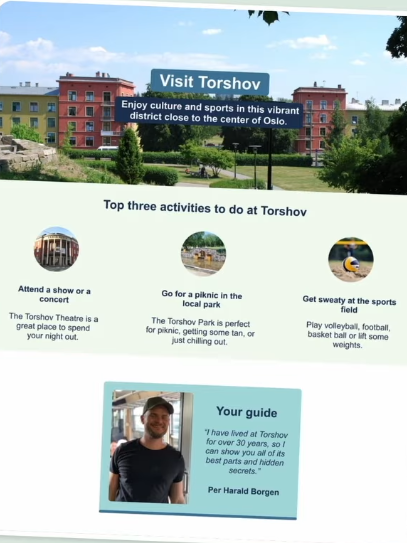

learning mern ?
 1)In the 48 hours we have completed 1 hour html basics see here "https://learningmern48.netlify.app/"

 for the one hour html intro learnt few tags (refer first commit)

 Intro to css:
 1)we have to put in head section the <link rel="stylesheet" href="style.css">
 
 #8b4513--->gives saddle brown (yes its rgb ratio somethig each two digits )
 